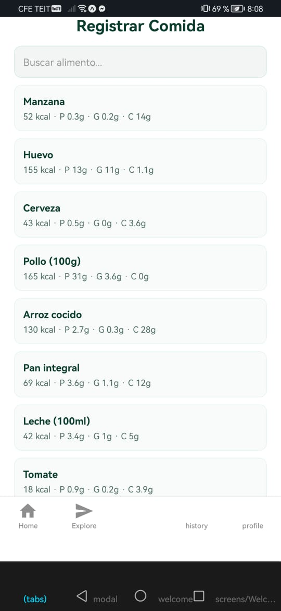
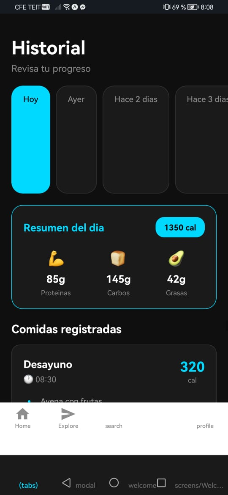

# MetaFitPro - App Contador de Calorías

## 1. Identificación del Proyecto

- **Nombre de la Aplicación:** MetaFitPro  
- **Asignatura:** Desarrollo de Aplicaciones Móviles  
- **Profesor:** M.C. Leonel González Vidales  
- **Periodo:** Agosto - Diciembre 2025  
- **URL del Repositorio:** https://github.com/yakshuri-varona/MetaFitPro

## 2. Descripción del Proyecto

**MetaFitPro** es una aplicación móvil diseñada para ayudar a los usuarios a conocer la información nutricional de diversos alimentos, frutas, bebidas o golosinas.  

Su principal funcionalidad consiste en permitir la búsqueda por nombre de alimento y mostrar macronutrientes: proteínas, carbohidratos y grasas.  

Permite agregar varios alimentos al día y ver cuántas calorías consumes.

- Muestra barra de progreso para ver tu meta diaria y calorías restantes
- Registro de historial de comidas
- Diseño moderno, amigable y responsivo con colores cálidos (amarillo) y estilo atractivo

### Características principales

- Búsqueda rápida y precisa de alimentos
- Información nutricional detallada
- Interfaz amigable con navegación intuitiva (Home, Explorar, Search, History y Perfil)
- Optimización para dispositivos Android mediante **Expo**

### Funcionalidades Implementadas

- Se agregaron más alimentos y categorías
- Se integraron recetas saludables relacionadas con cada alimento
- Se muestra el total de calorías según la cantidad del alimento o en varias cantidades de alimentos

## 3. Tecnologías y Versiones Utilizadas

### Stack Tecnológico

- **React Native** con **Expo**
- **Node.js**
- **Expo Router**
- **JavaScript (ES6+)**
- **API Ninjas Nutrition** (para datos nutricionales)

> This is an [Expo](https://expo.dev) project created with [`create-expo-app`](https://www.npmjs.com/package/create-expo-app).

### Herramientas de Desarrollo

- Visual Studio Code
- Git y GitHub
- Expo Go (para pruebas móviles)

### Verificación del Entorno

- Node.js versión 18 o superior
- Expo CLI instalado globalmente
- Conexión a internet para consumir la API

## 4. Estructura del Proyecto

### Organización de Archivos
```
METAFITPRO/
├── app/                    # Navegación principal y rutas
│   ├── (tabs)/            # Pantallas con navegación por pestañas
│   │   ├── _layout.tsx    # Layout del tab navigator
│   │   ├── explore.tsx    # Pantalla de exploración
│   │   ├── history.tsx    # Historial de entrenamientos
│   │   ├── index.tsx      # Pantalla principal
│   │   ├── profile.tsx    # Perfil de usuario
│   │   └── search.tsx     # Búsqueda de ejercicios
│   └── screens/           # Pantallas adicionales
├── assets/                # Recursos estáticos
├── components/            # Componentes reutilizables
├── constants/             # Constantes de la aplicación
├── hooks/                 # Custom hooks
├── node_modules/          # Dependencias
├── scripts/               # Scripts de utilidad
├── .gitignore            # Archivos ignorados por Git
├── app.json              # Configuración de Expo
├── config.ts             # Configuración de la app
├── eslint.config.js      # Configuración de ESLint
├── expo-env.d.ts         # Tipos de TypeScript para Expo
├── npx                   # Ejecutor de paquetes
├── package.json          # Dependencias del proyecto
├── package-lock.json     # Lockfile de dependencias
├── README.md             # Este archivo
└── tsconfig.json         # Configuración de TypeScript
```

### Arquitectura

La aplicación sigue una arquitectura modular basada en componentes de React Native, con navegación mediante `expo-router` y consumo de datos desde la API.

## 5. Instalación y Configuración

### 1. Clonar el repositorio
```bash
git clone https://github.com/yakshuri-varona/MetaFitPro-App.git
```

### 2. Instalar dependencias

```bash
cd MetaFitPro-App
npm install
```

### Dependencias del Proyecto

- expo
- react
- react-native
- expo-router

### Verificación del Entorno
```bash
node -v
npm -v
expo --version
```

## 6. Ejecución de la Aplicación

### Get started

**1. Install dependencies**

```bash
npm install
```

**2. Start the app**

```bash
npx expo start
```

### Scripts Disponibles
```bash
npx expo start
```

### Primera Ejecución

1. **Instalar dependencias:**  
   Abre una terminal en la carpeta del proyecto.

2. **Iniciar el servidor de desarrollo:**  
   Ejecuta `npx expo start`.  
   Escanea el código QR desde la app Expo Go en tu celular.

3. **Conectar dispositivo:**
   - **Android:** Usar Expo Go o emulador
   - **iOS:** Usar Expo Go o simulador
   - **Web:** Se abrirá automáticamente en el navegador

### Notas de Entorno

> ⚠️ Si ocurre un error con `package.json`, asegúrate de estar en la carpeta raíz del proyecto antes de ejecutar Expo.

## 7. Funcionalidades dentro de la Aplicación

### Pantalla principal


- Muestra un cuadro con el total de calorías, la meta y los restantes
- Muestra otro cuadro con los macronutrientes, el cual contiene (Proteínas, Carbohidratos y Grasas)
- Muestra la opción de agregar comidas
- Muestra el historial
- Muestra un mensaje con un consejo del día


### **Pantalla de búsqueda:**
.

En esta pantalla, el usuario puede escribir el nombre de una fruta, alimento, bebida o golosina para obtener información nutricional detallada (calorías, proteínas, carbohidratos, grasas, etc.).

### **Datos de Ejemplo:**
- Manzana 🍎
- Banana 🍌
- Chocolate 🍫
- Leche 🥛
- Huevo 🥚
- Tomate 🍅
- Cerveza 🍺

### **Pantalla de Historial:**


- Muestra el progreso.
- Muestra el historial de días anteriores.
- Muestra el resumen del día.
- Se muestra el registro de comidas.

### **Características técnicas:**
- Peticiones HTTP con fetch API.
- Integración directa con API Ninjas Nutrition.
- Renderizado dinámico de los resultados.
- Manejo de errores y respuestas nulas.

---

## **8. Desarrollo y Extensiones**
- Se agregaron más alimentos y categorías.
- Se integraron recetas saludables relacionadas con cada alimento.
- Se muestra el total de calorías según la cantidad del alimento.
- Se agregó la opción de contar las calorías de varios alimentos juntos.

---

## **9. Troubleshooting**

| Problema                               | Causa                                    | Solución                                               |
| -------------------------------------- | ---------------------------------------- | ------------------------------------------------------ |
| `package.json no existe`               | Se ejecutó el comando fuera del proyecto | Navegar a la carpeta raíz antes de ejecutar            |
| Error con `_layout.js` y `_layout.tsx` | Conflicto de rutas en Expo Router        | Eliminar uno de los dos archivos duplicados            |
| "Command not recognized"               | Falta de PATH de Node.js                 | Reinstalar Node.js o configurar la variable de entorno |

### **Comandos comunes:**
```bash
npx expo start        # Inicia la app
npm install           # Instala dependencias
git add .             # Agrega cambios
git commit -m "Update"
git push              # Sube al repositorio
```

---

## **10. Recursos y Documentación**

- [Documentación oficial de React Native](https://reactnative.dev/)
- [Expo Documentation](https://docs.expo.dev/)
- [API Ninjas Nutrition](https://api-ninjas.com/api/nutrition)
- [Guía de Markdown para GitHub](https://guides.github.com/features/mastering-markdown/)

---

**Desarrollado por:** Yakshuri Varona  
**GitHub:** [@yakshuri-varona](https://github.com/yakshuri-varona)  
**Última actualización:** 9 de Noviembre 2025  
**Versión:** 1.1.0
